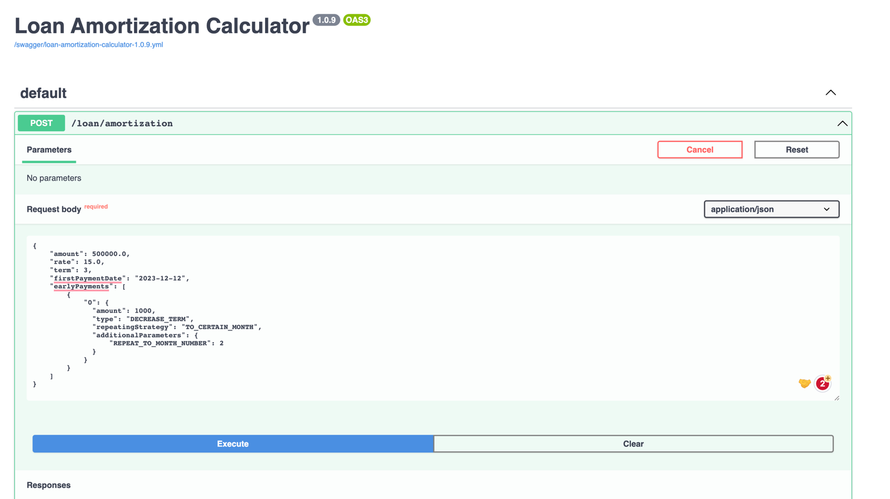

# Loan Amortization Calculator Service
This project is a wrapper around [loan amortization library](https://github.com/ArtyomPanfutov/loan-amortization-calculator) and provides HTTP API to that library. </br>
It provides a public docker image that you can host wherever you like.
## How to run locally
* Pull the image
TBD
* Start the container TBD

## API Reference
You can try API via swagger. It is available on path `/swagger-ui`, e.g.  `http://localhost:8080/swagger-ui`

## Request example
Look at the [request body](#request_body). This is a loan with two early payments.<br> 
Note, that we specified only **one** early payment in the input, but it has a special repeating strategy — `TO_CERTAIN_MONTH`. </br>
This strategy will apply that early payment for every next month starting from the current until the month number specified in the additional parameters `REPEAT_TO_MONTH_NUMBER`.</br>
When you don't want to repeat an early payment — set the repeating strategy to `SINGLE`.
### <a name="request_body"></a> Request body
```json
{
    "amount": 500000.0,
    "rate": 15.0,
    "term": 3,
    "firstPaymentDate": "2023-12-12",
    "earlyPayments": [
        {
            "0": {
            "amount": 1000,
            "type": "DECREASE_TERM",
            "repeatingStrategy": "TO_CERTAIN_MONTH",
            "additionalParameters": {
                    "REPEAT_TO_MONTH_NUMBER": 2
                }  
            }
        }
    ]
}
```

### Response
<details>
  <summary>Click to show the response</summary>

```json
{
    "monthlyPaymentAmount": 170850.59,
    "overPaymentAmount": 12541.64,
    "monthlyPayments": [
        {
            "monthNumber": 0,
            "loanBalanceAmount": 500000.0,
            "debtPaymentAmount": 165686.21,
            "interestPaymentAmount": 6164.38,
            "paymentAmount": 171850.59,
            "additionalPaymentAmount": 1000.0,
            "paymentDate": [
                2023,
                12,
                12
            ]
        },
        {
            "monthNumber": 1,
            "loanBalanceAmount": 334313.79,
            "debtPaymentAmount": 167591.52,
            "interestPaymentAmount": 4259.07,
            "paymentAmount": 171850.59,
            "additionalPaymentAmount": 1000.0,
            "paymentDate": [
                2024,
                1,
                12
            ]
        },
        {
            "monthNumber": 2,
            "loanBalanceAmount": 166722.27,
            "debtPaymentAmount": 166722.27,
            "interestPaymentAmount": 2118.19,
            "paymentAmount": 168840.46,
            "additionalPaymentAmount": 0,
            "paymentDate": [
                2024,
                2,
                12
            ]
        }
    ],
    "earlyPayments": {
        "0": {
            "amount": 1000.0,
            "repeatingStrategy": "SINGLE",
            "strategy": "DECREASE_TERM"
        },
        "1": {
            "amount": 1000.0,
            "repeatingStrategy": "SINGLE",
            "strategy": "DECREASE_TERM"
        }
    }
}
```
</details>
